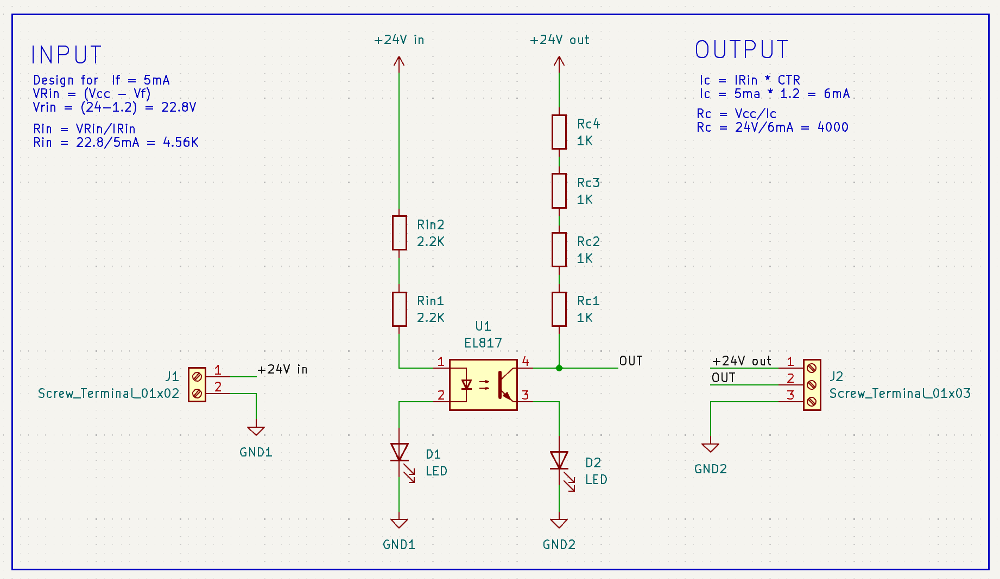

# Opto-isolator

The goal is to make isolated boards for external control of some equipment. To read signals and to send signals.

In my case it's a CO2 laser what I want automatically control.

_____
Tauno Erik 2024
